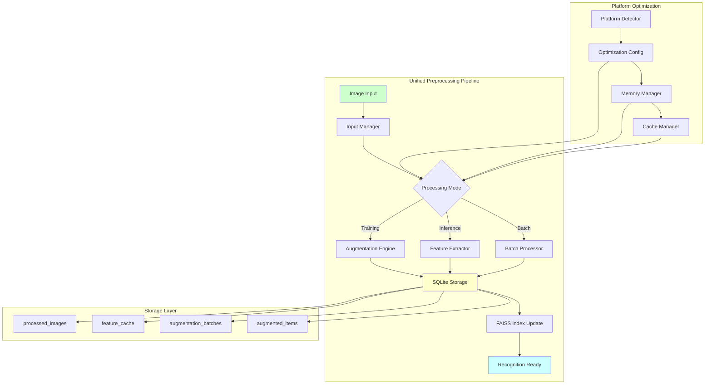
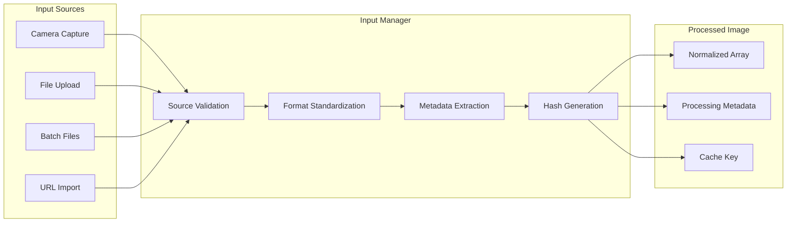
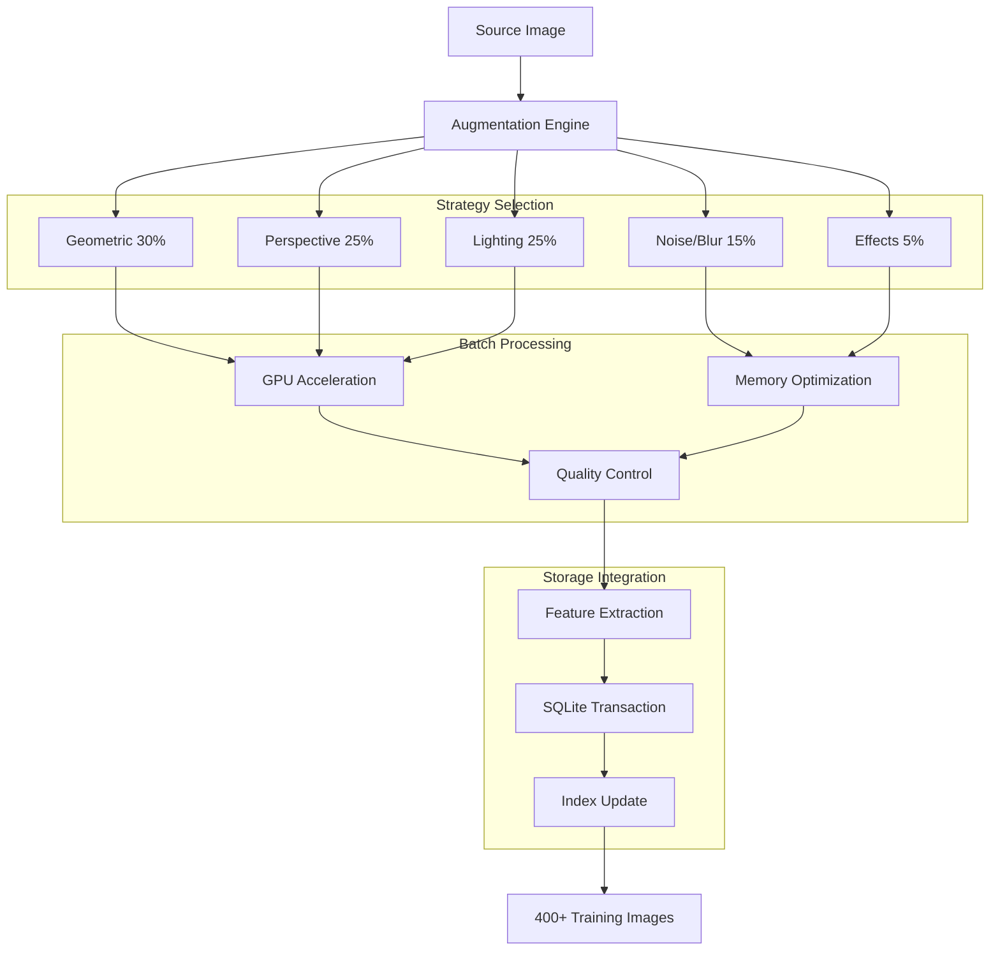
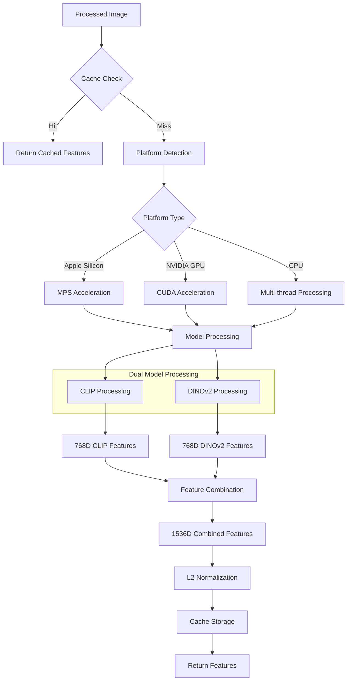
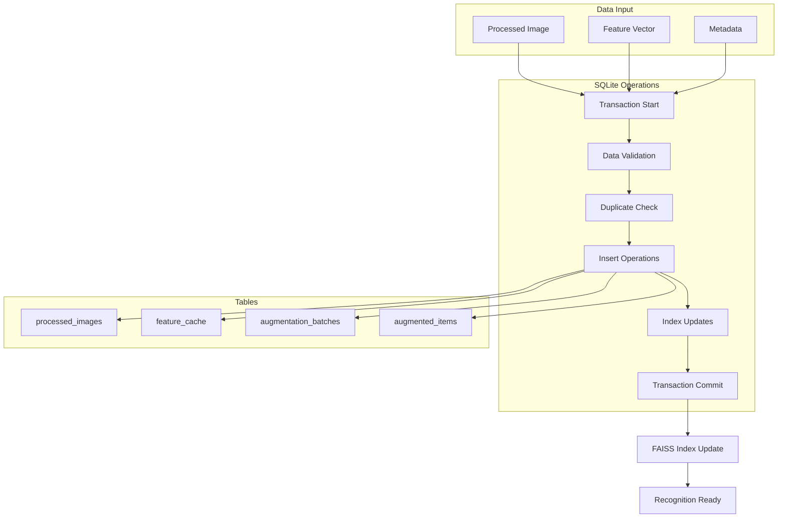
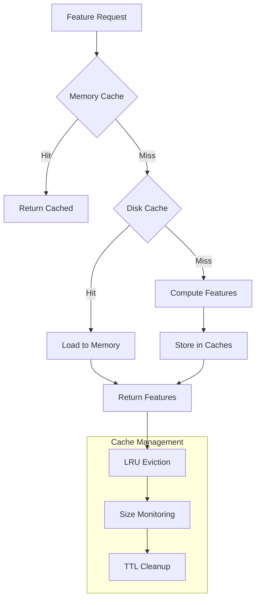
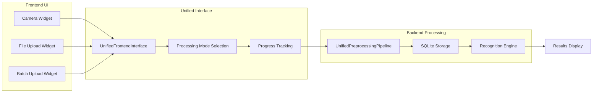
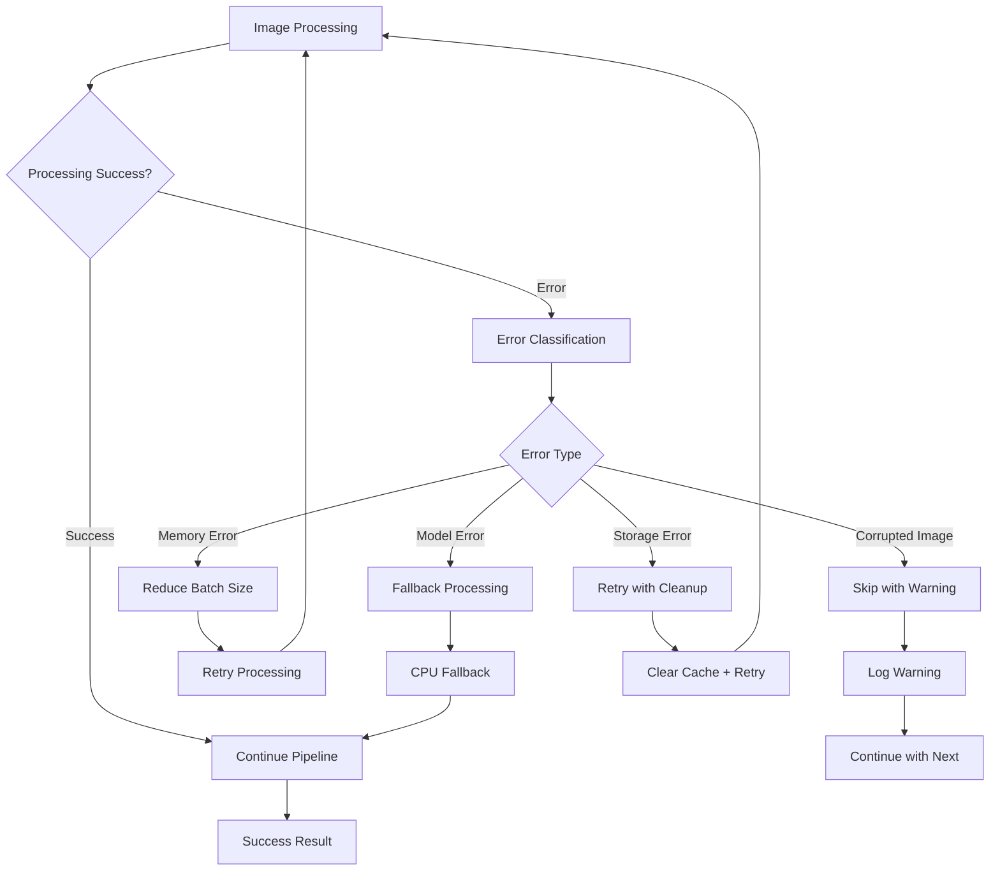

# 🔄 Unified Preprocessing System Flow Diagrams

## Current System vs Unified System

### **CURRENT SYSTEM** (Scattered Architecture)

```mermaid
graph TD
    subgraph "Training Flow"
        A1[Raw Images] --> B1[prepare.py]
        B1 --> C1[Manual Augmentation]
        C1 --> D1[Augmented Images]
        D1 --> E1[Manual Feature Extraction]
        E1 --> F1[features.h5]
    end
    
    subgraph "Recognition Flow"
        A2[Input Image] --> B2[feature_extractor.py]
        B2 --> C2[CLIP + DINOv2]
        C2 --> D2[1536D Features]
        D2 --> E2[FAISS Search]
        E2 --> F2[Recognition Result]
    end
    
    subgraph "Storage Flow"
        A3[Multiple Images] --> B3[Manual Scripts]
        B3 --> C3[Scattered Processing]
        C3 --> D3[Legacy Storage]
        D3 --> E3[Index Rebuilding]
    end
    
    style A1 fill:#ffcccc
    style A2 fill:#ffcccc
    style A3 fill:#ffcccc
    style F1 fill:#ccccff
    style F2 fill:#ccccff
    style E3 fill:#ccccff
```


### **UNIFIED SYSTEM** (Integrated Architecture)


## Detailed Component Flow

### **1. Image Input Processing**


### **2. Training Augmentation Flow**


### **3. Feature Extraction Flow**


### **4. SQLite Integration Flow**


## Performance Optimization Flow

### **Memory Management**
```mermaid
graph LR
    A[Memory Monitor] --> B{Available Memory}
    B -->|High| C[Large Batches]
    B -->|Medium| D[Standard Batches]
    B -->|Low| E[Small Batches + Cleanup]
    
    C --> F[Batch Processing]
    D --> F
    E --> F
    
    F --> G[Memory Cleanup]
    G --> H{GPU Memory}
    H -->|CUDA| I[torch.cuda.empty_cache()]
    H -->|MPS| J[torch.mps.empty_cache()]
    H -->|CPU| K[gc.collect()]
    
    I --> L[Next Batch]
    J --> L
    K --> L
```

### **Caching Strategy**


## Integration Points

### **Frontend Integration**


### **API Integration**
```mermaid
graph TD
    subgraph "REST API Endpoints"
        A1[/upload/single]
        A2[/upload/batch]
        A3[/process/augment]
        A4[/recognize/image]
    end
    
    subgraph "Unified Processing"
        B1[Request Validation]
        B2[Processing Mode Detection]
        B3[Pipeline Execution]
        B4[Response Formatting]
    end
    
    A1 --> B1
    A2 --> B1
    A3 --> B1
    A4 --> B1
    
    B1 --> B2
    B2 --> B3
    B3 --> B4
    
    B4 --> C[JSON Response]
```

## Error Handling Flow

### **Processing Pipeline Error Handling**


This comprehensive flow diagram shows how the unified preprocessing system will consolidate all image processing workflows into a single, efficient, platform-optimized pipeline with SQLite integration. The system provides clear separation of concerns while maintaining high performance and error resilience.